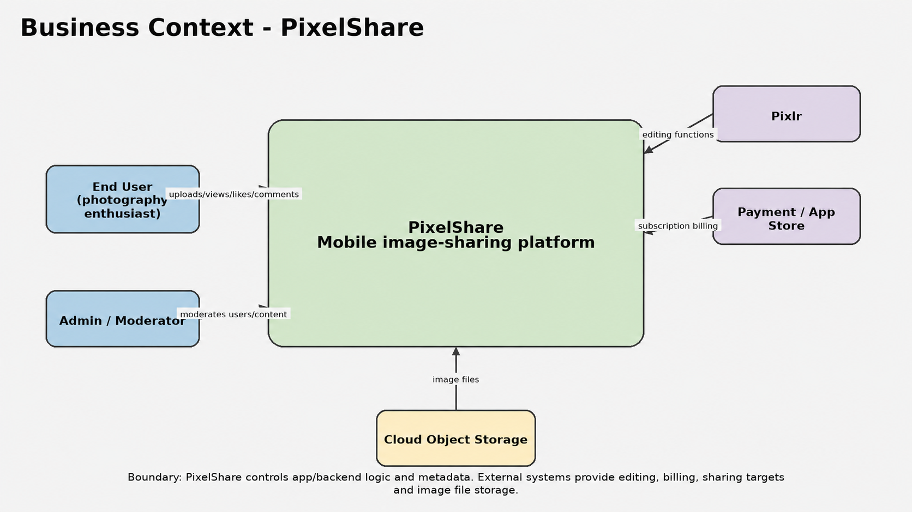
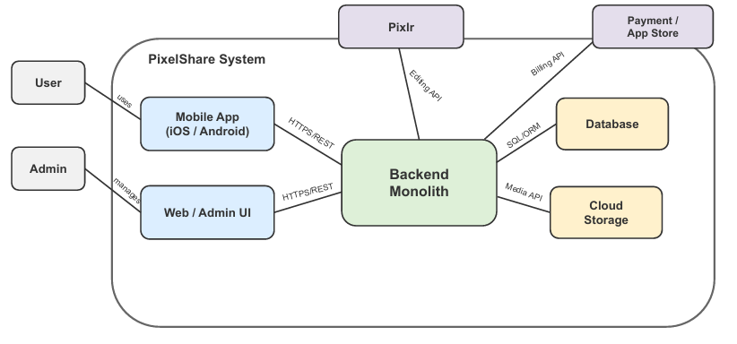
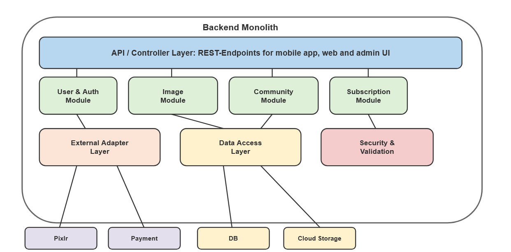
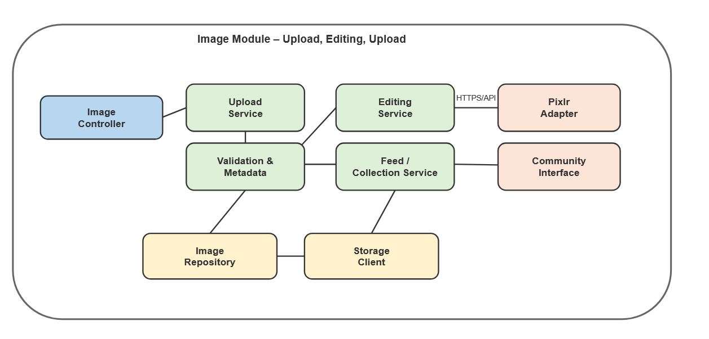
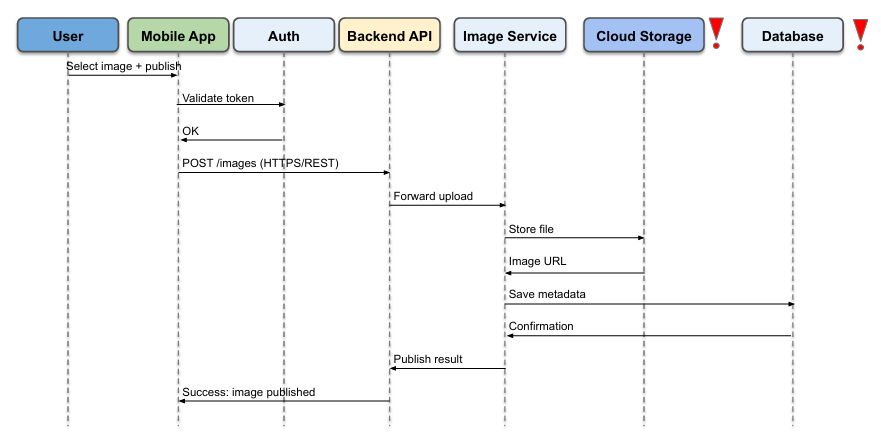
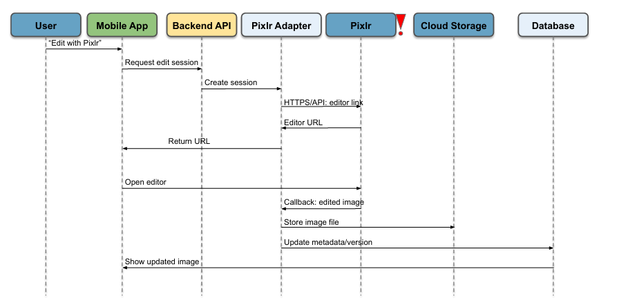
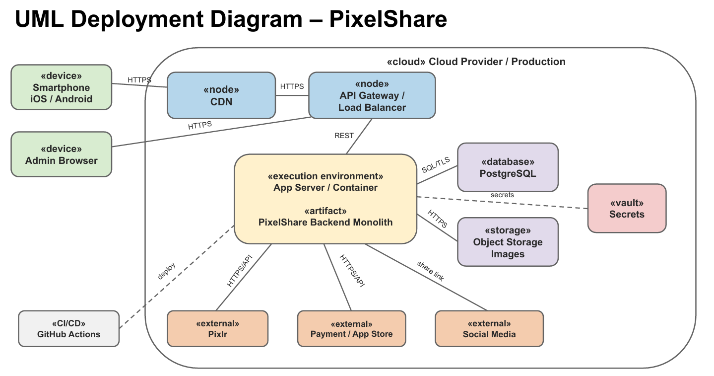
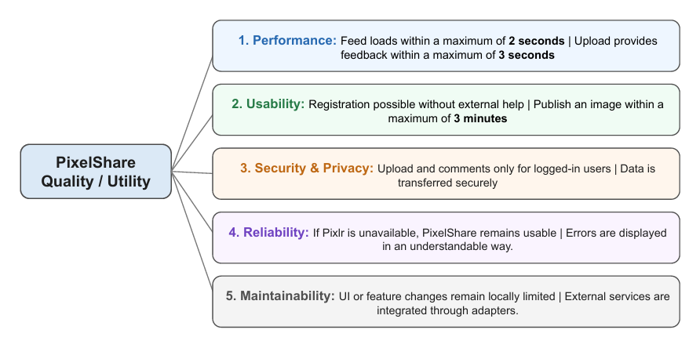

# arc42 Architecture Documentation - PixelShare

**System:** PixelShare  
**Document status:** Completed architecture documentation for the MVP  
**Architecture style:** Monolithic backend with a layered internal structure  
**Main scenario:** Mobile image-sharing app for photography enthusiasts

This document describes the software architecture of PixelShare using the arc42 structure. The content is based on the PixelShare scenario and the SWARC work products for introduction, solution strategy, constraints, cross-cutting concepts, quality, building blocks, runtime and deployment.

## Document Control

| Item                      | Value                                                                                                      |
| ------------------------- | ---------------------------------------------------------------------------------------------------------- |
| Team                      | PixelShare                                                                                                 |
| Version                   | 1.0                                                                                                        |
| Status                    | Completed draft for review                                                                                 |
| Main architecture drivers | Fast MVP delivery, performance for images, security/privacy, maintainability                               |
| Main evaluation focus     | Complete arc42 chapters, measurable quality scenarios, traceability, readable diagrams, risks and glossary |

# 1. Introduction and Goals

## 1.1 Requirements Overview

PixelShare is a mobile image-sharing app for photography enthusiasts and visual storytellers. Users can upload high-quality images, edit them, organize them, discover images from other users and share content within a photography-oriented community.

PixelShare is intended as a multiplatform application for iOS and Android. The MVP focuses on the core user journey: registration, login, image upload, image publication, feed/profile display, basic community interaction, Pixlr-based editing and subscription support.

| Main Purpose                         | Main Features                                   |
| ------------------------------------ | ----------------------------------------------- |
| Specialized platform for photography | Registration and login                          |
| Sharing visually appealing photos    | Uploading and sharing images                    |
| Editing tools                        | Advanced image editing and Pixlr integration    |
| Collections and user profiles        | Community interaction: likes, comments, follows |
| Photography-oriented community       | Content moderation and reporting                |
| Multiplatform application            | Subscription model with free and paid plans     |

**Core functional requirements**

1. Users can register, log in and manage a profile.
2. Users can upload images with title, description, tags and visibility settings.
3. Users can view images in feeds, profiles, image details and collections.
4. Users can like, comment on and share images.
5. Users can open an image-editing flow through Pixlr.
6. Users can use free or paid subscription options.
7. Admins and moderators can review reports and manage inappropriate content.
8. Support staff can analyze user-facing errors such as login, upload, subscription and editing problems.

## 1.2 Quality Goals

| Priority | Quality Goal                | Motivation and Concrete Scenario                                                                                                                                                                                                   |
| -------- | --------------------------- | ---------------------------------------------------------------------------------------------------------------------------------------------------------------------------------------------------------------------------------- |
| 1        | Performance and Reliability | The app should function quickly, stably and with minimal errors. A user opens the Home Feed under normal conditions and the first visible images and posts are loaded within 2 seconds. Upload feedback is shown within 3 seconds. |
| 2        | Privacy and Security        | Users create personal accounts, upload their own images and may use paid subscriptions. A non-logged-in user who tries to upload an image or write a comment is immediately blocked and asked to log in.                           |
| 3        | Usability and Learnability  | The app should be easy to use and quickly understandable. A new user registers, uploads an image and publishes it with title and description within 3 minutes without external help.                                               |

## 1.3 Stakeholders

| Role/Name                              | Expectations                                                                                                                                                         |
| -------------------------------------- | -------------------------------------------------------------------------------------------------------------------------------------------------------------------- |
| End User - Lisa Mueller                | PixelShare should enable users to easily upload, view, share, discover, like and comment on images. In addition, a photography-oriented community should be created. |
| Development Team - CodeCraft Solutions | PixelShare requires clear technical requirements, a maintainable architecture and stable performance so that the app can be developed, maintained and improved.      |
| UI/UX Designer - Clara Weber           | PixelShare should be designed in a user-friendly and visually appealing way, so users can navigate the app easily and the images remain the main focus.              |
| Support Team - HelpDesk PixelShare     | PixelShare requires understandable error reports and user information so that support can help with login, upload, subscription and image-editing problems.          |
| Content Moderator - Sophie Keller      | PixelShare requires tools to review inappropriate content, handle reports and manage user behavior within the community.                                             |

# 2. Architecture Constraints

## C_1 Budget Limitation for the MVP

- **Type:** Budget / organizational
- **Constraint:** The MVP must not cost more than 72,000 EUR. This includes development, testing, basic cloud/tooling costs and preparation for the app stores.
- **Motivation:** The budget is fixed because a start-up has limited financial resources.

## C_2 Limited Effort and Timeline

- **Type:** Time / effort
- **Constraint:** The MVP must be delivered within 6 team sprints of 2 weeks each. This equals approximately 240 person-days.
- **Motivation:** The scope must focus first on core features to ensure a realistic implementation.

## C_3 Platform Requirements: iOS and Android

- **Type:** Technical / product
- **Constraint:** PixelShare must be available on both iOS and Android.
- **Motivation:** The architecture must support both platforms with as little additional effort as possible.

## C_4 Monolithic Architecture with a Clear Layer Structure

- **Type:** Architectural
- **Constraint:** The backend is implemented as a monolith with a layered architecture: Presentation/API, Business Logic and Data Source.
- **Motivation:** Dependencies only flow downwards so that the monolith remains understandable and maintainable.

## C_5 Privacy and Secure Communication

- **Type:** Legal / security
- **Constraint:** Pixlr, image storage and subscription/payment interfaces must be integrated securely. Personal data and images must comply with GDPR and privacy requirements.
- **Motivation:** PixelShare processes personal accounts, images and possible subscription data.

# 3. System Scope and Context

PixelShare is documented as a system that interacts with mobile users, administrators, external editing and billing providers, cloud storage and social-media sharing targets. The core system boundary contains the mobile app, the admin interface and the backend monolith. External systems are integrated through clearly defined technical interfaces.

## 3.1 Business Context

| Communication Partner     | Input to PixelShare                                                                                                    | Output from PixelShare                                                                          |
| ------------------------- | ---------------------------------------------------------------------------------------------------------------------- | ----------------------------------------------------------------------------------------------- |
| End User                  | Registration data, login credentials, images, titles, descriptions, tags, likes, comments, reports and sharing actions | Feeds, profiles, image details, upload results, comments, likes, error messages and share links |
| Admin / Content Moderator | Moderation decisions, content review actions and user-management actions                                               | Report lists, flagged content, user information and moderation result feedback                  |
| Pixlr                     | Edited image callbacks or editing result information                                                                   | Image or image URL for editing, edit-session request, editor configuration                      |
| Payment / App Store       | Payment confirmation, subscription status and billing events                                                           | Subscription request and product/payment information                                            |
| Social Media Platforms    | No direct business input required for MVP                                                                              | Public image or post links that users share outside PixelShare                                  |
| Cloud Object Storage      | Stored image objects and image URLs                                                                                    | Image files, thumbnails and versioned image files                                               |

## 3.2 Technical Context

| Channel / Interface | Source                             | Target                    | Protocol / Format                  | Purpose                                                                  |
| ------------------- | ---------------------------------- | ------------------------- | ---------------------------------- | ------------------------------------------------------------------------ |
| Mobile API          | Mobile App                         | API Gateway / Backend API | HTTPS/REST, JSON, multipart upload | Registration, login, feed loading, image upload, comments and likes      |
| Admin API           | Web/Admin UI                       | API Gateway / Backend API | HTTPS/REST, JSON                   | Moderation and administration                                            |
| Persistence         | Backend Monolith                   | PostgreSQL                | SQL over TLS / ORM                 | User data, image metadata, comments, likes, subscriptions and audit data |
| Media Storage       | Backend Monolith                   | Object Storage            | HTTPS / S3-compatible API          | Store original images, edited images and thumbnails                      |
| Editing Integration | Backend Monolith / Pixlr Adapter   | Pixlr                     | HTTPS/API                          | Create edit sessions and receive edited images                           |
| Billing Integration | Backend Monolith / Payment Adapter | Payment / App Store       | HTTPS/API                          | Subscription and billing processing                                      |
| Sharing             | Mobile App / Backend               | Social Media Platforms    | Share link / HTTPS                 | Share public PixelShare links outside the app                            |
| Deployment          | GitHub Actions                     | Cloud infrastructure      | CI/CD pipeline, HTTPS, secrets     | Build, test and deploy the backend application                           |

# 4. Solution Strategy

The architecture strategy focuses on delivering a reliable MVP with limited budget and team capacity. Therefore, PixelShare uses a simple and maintainable monolithic backend, clear internal layers, cloud/file storage for media files and adapter components for external providers.

| Goal / Requirement                     | Architectural Approach                                                                                                                                                                                         |
| -------------------------------------- | -------------------------------------------------------------------------------------------------------------------------------------------------------------------------------------------------------------- |
| Fast MVP for a start-up                | PixelShare is implemented as one central application with a single deployable backend unit. This simplifies development, testing and operation. The codebase follows clean code principles from the beginning. |
| Good image performance                 | Images are stored in object storage, while the database stores metadata such as titles, tags, likes and comments. Feeds and profiles can additionally be cached.                                               |
| Secure user accounts and subscriptions | Central authentication, admin roles, encrypted passwords and secure payment processing through a payment provider are used.                                                                                    |
| Maintainable Pixlr integration         | Pixlr is integrated through a dedicated adapter component. This keeps the third-party dependency isolated and makes it easier to change or replace later.                                                      |
| Consistency for image upload           | The upload process is CP-oriented: an image is only published after the file and metadata are successfully stored. Errors lead to FAILED status or compensating cleanup.                                       |

# 5. Building Block View

The building block view shows the static decomposition of PixelShare. It uses three levels: the overall system, the internal backend decomposition and the detailed core-domain image module.

## 5.1 Level 1 - Whitebox Overall System

**Motivation**  
Level 1 shows the main building blocks of PixelShare and the most important external systems. This view is intentionally abstract, so that non-technical stakeholders can understand the overall system without implementation details.

| Building Block      | Responsibility                                                                                                                       |
| ------------------- | ------------------------------------------------------------------------------------------------------------------------------------ |
| Mobile App          | iOS/Android client for end users. Handles user interaction, upload selection, feed navigation, community actions and local UI flows. |
| Web / Admin UI      | Browser-based interface for administration and content moderation.                                                                   |
| Backend Monolith    | Central server-side application. Contains API endpoints, business logic, integration logic and access to persistence.                |
| PostgreSQL Database | Stores structured data: users, profiles, image metadata, comments, likes, subscriptions, moderation states and audit data.           |
| Object Storage      | Stores large binary image files, edited image versions and thumbnails.                                                               |
| Pixlr               | External image-editing provider accessed through the Pixlr Adapter.                                                                  |
| Payment / App Store | External billing and subscription provider.                                                                                          |
| Social Media        | External sharing target for public PixelShare links.                                                                                 |

## 5.2 Level 2 - Whitebox Backend Monolith

**Motivation**  
Level 2 decomposes the backend monolith into layers and modules. The backend remains one deployable unit, but the internal structure separates API handling, business logic, data access, security validation and external adapters.

| Building Block         | Responsibility                                                                                                                                      |
| ---------------------- | --------------------------------------------------------------------------------------------------------------------------------------------------- |
| API / Controller Layer | Provides REST endpoints for the mobile app, web/admin UI and external callbacks. It validates request shape and delegates business work to modules. |
| User & Auth Module     | Handles registration, login, user profiles, session/token handling and account-related business rules.                                              |
| Image Module           | Core-domain module for upload, validation, metadata, editing, publication, feed and collection integration.                                         |
| Community Module       | Handles likes, comments, follows, reports and community feed interactions.                                                                          |
| Subscription Module    | Handles subscription state, paid-plan access and communication with payment providers.                                                              |
| Security & Validation  | Centralized authentication, authorization, role checks, input validation and protection of sensitive operations.                                    |
| Data Access Layer      | Encapsulates repositories and data access to PostgreSQL and metadata persistence.                                                                   |
| External Adapter Layer | Encapsulates technical access to Pixlr, Payment/App Store and object storage. It isolates third-party API changes from business modules.            |

**Important dependency rule**  
Dependencies flow from API to business logic and from business logic to data access or adapters. Business modules must not directly depend on provider-specific API details.

## 5.3 Level 3 - Whitebox Image Module

**Motivation**  
Level 3 zooms into the core domain of PixelShare: image upload, editing and publication. This area is architecturally important because it directly supports the main business value of the app.

| Building Block            | Responsibility                                                                   |
| ------------------------- | -------------------------------------------------------------------------------- |
| Image Controller          | Receives upload, edit and publication requests from the API layer.               |
| Upload Service            | Coordinates file upload, metadata creation and publication state transitions.    |
| Validation & Metadata     | Checks file type, file size, ownership, visibility, title, description and tags. |
| Editing Service           | Coordinates Pixlr editing sessions and stores edited image versions.             |
| Feed / Collection Service | Makes published images available in feeds, profiles and collections.             |
| Image Repository          | Persists and reads image metadata from PostgreSQL.                               |
| Storage Client            | Stores and retrieves image files from object storage.                            |
| Pixlr Adapter             | Creates Pixlr edit sessions and handles edited-image callbacks.                  |
| Community Interface       | Provides image-related hooks for likes, comments and reporting.                  |

# 6. Runtime View

The runtime view documents two architecturally relevant scenarios: image upload/publication and image editing with Pixlr. They are relevant because they involve multiple internal components and external systems.

## 6.1 Runtime Scenario 1 - Upload and Publish Image

**Description**

1. The user selects an image in the mobile app and chooses to publish it.
2. The mobile app validates the token with the Auth component.
3. After successful authentication, the mobile app sends `POST /images` to the Backend API over HTTPS/REST.
4. The Backend API forwards the request to the Image Service.
5. The Image Service stores the file in Object Storage.
6. Object Storage returns an image URL.
7. The Image Service stores metadata in PostgreSQL.
8. After confirmation from the database, the publication result is returned to the mobile app.
9. The user sees that the image has been published.

**Critical architectural aspects**

- The scenario is CP-oriented in terms of the CAP discussion: consistency and partition tolerance are preferred over maximum availability.
- The image becomes visible only after file storage and metadata persistence both succeed.
- If storage or database persistence fails, the upload is not published. The system sets status `FAILED` or deletes the already stored file as compensation.

## 6.2 Runtime Scenario 2 - Edit and Save Image with Pixlr

**Description**

1. The user chooses "Edit with Pixlr" in the mobile app.
2. The mobile app requests an edit session from the Backend API.
3. The Backend API delegates the request to the Pixlr Adapter.
4. The Pixlr Adapter creates a session with Pixlr through HTTPS/API.
5. Pixlr returns an editor URL.
6. The URL is returned to the mobile app and the editor is opened.
7. After editing, Pixlr sends a callback with the edited image.
8. PixelShare stores the edited image file in Object Storage.
9. PixelShare updates the metadata or image version in the database.
10. The mobile app displays the updated image.

**Critical architectural aspects**

- Pixlr is isolated behind an adapter component.
- If Pixlr is unavailable, PixelShare remains usable for feed, profile, upload and community functions.
- Editing errors are displayed in an understandable way to the user.

# 7. Deployment View

## 7.1 Infrastructure Level 1

**Motivation**  
The deployment view maps software building blocks to infrastructure elements. PixelShare uses a cloud-based production environment to support global mobile access, scalable image delivery, secure secrets management and repeatable deployments.

**Quality and Performance Features**

- The CDN improves global delivery of static content and images.
- The API Gateway / Load Balancer centralizes routing, authentication support, rate limiting and logging.
- The backend monolith runs in an app server/container and can later be scaled horizontally if needed.
- PostgreSQL stores structured data and must be backed up regularly.
- Object Storage stores large media files and reduces database load.
- Vault or a cloud secrets manager protects API keys, database passwords and provider credentials.
- CI/CD through GitHub Actions provides reproducible builds, tests and deployments.

**Mapping of Building Blocks to Infrastructure**

| Software Building Block | Infrastructure Element                                        |
| ----------------------- | ------------------------------------------------------------- |
| Mobile App              | Smartphone device, distributed through iOS/Android app stores |
| Web / Admin UI          | Admin browser, delivered over HTTPS                           |
| API / Controller Layer  | App Server / Container behind API Gateway / Load Balancer     |
| Backend Monolith        | PixelShare backend artifact running in the app container      |
| Data Access Layer       | PostgreSQL database over SQL/TLS                              |
| Storage Client          | Object Storage over HTTPS / S3-compatible API                 |
| Pixlr Adapter           | External Pixlr system over HTTPS/API                          |
| Payment Adapter         | Payment / App Store provider over HTTPS/API                   |
| Secrets Access          | Vault / secrets manager                                       |
| Deployment Pipeline     | GitHub Actions                                                |

# 8. Cross-cutting Concepts

Cross-cutting concepts are system-wide rules that affect multiple modules and layers. They improve conceptual integrity and support the quality goals of maintainability, security, reliability and performance.

## 8.1 Consistent Development and Documentation Process

**Goal**  
Ensure that all developers work with the same process and documentation rules.

**Rules**

- Use a shared Git workflow with pull requests.
- Perform code reviews before merging into the main branch.
- Document relevant architecture decisions as ADRs.
- Keep diagrams and arc42 documentation aligned with implementation changes.
- Apply KISS and YAGNI to avoid over-engineering for the MVP.

**Affected areas**  
All developers, all modules, all architecture decisions and the CI/CD pipeline.

## 8.2 Layered Architecture with Clear Responsibilities

**Goal**  
Keep the monolith maintainable by enforcing a clear internal structure.

**Rules**

- Presentation/API layer handles incoming requests and responses.
- Business Logic layer contains business rules for upload, comments, likes, subscriptions and moderation.
- Data Source layer encapsulates database, object storage and external technical integrations.
- Dependencies flow downwards only.
- New features follow the same structure.

**Affected areas**  
Backend monolith, API endpoints, business modules, repositories and adapter components.

## 8.3 Security, Authorization and Privacy

**Goal**  
Protect user accounts, images, subscription data and admin functions.

**Rules**

- Users must log in before uploading images, commenting or using protected functions.
- Admin and moderation operations require role-based authorization.
- Passwords are stored encrypted/hashed, never in plain text.
- All communication with external systems uses HTTPS/TLS.
- Sensitive keys and credentials are stored in Vault or a cloud secrets manager.
- Personal data and images must comply with GDPR/privacy requirements.

**Affected areas**  
Login, upload, comments, subscription, admin functions, Pixlr integration, payment integration, cloud storage and APIs.

## 8.4 Error Handling and Resilience

**Goal**  
Keep user-visible behavior understandable and avoid inconsistent system states.

**Rules**

- Technical errors are logged with context, but user messages remain understandable.
- Pixlr outages must not make the whole app unavailable.
- Upload failures must not create published images without valid metadata.
- Cloud storage and database failures lead to a failed upload state or compensating cleanup.
- External adapters handle provider-specific error responses.

**Affected areas**  
Image upload, editing, feeds, Pixlr adapter, payment adapter, support diagnostics and monitoring.

## 8.5 Configuration and Secrets Management

**Goal**  
Separate configuration from code and protect sensitive operational data.

**Rules**

- Environment-specific configuration is provided through deployment configuration.
- Secrets are injected securely at runtime through Vault or a secrets manager.
- No passwords, API keys or certificates are committed to source code.
- Configuration changes must be documented and reviewed.

**Affected areas**  
Backend deployment, database connection, Pixlr API credentials, payment credentials, CI/CD pipeline and production operations.

# 9. Architecture Decisions

## ADR-001: Use a Monolithic Backend with Layered Internal Structure

- **Status:** Accepted
- **Context:** The MVP must be implemented with a small team, limited budget and short timeline.
- **Considered alternatives:** Monolith, SOA, microservices.
- **Decision:** PixelShare uses a monolithic backend with a layered internal structure.
- **Rationale:** A single deployable unit is easier to develop, test and operate for a start-up MVP. Microservice complexity is not necessary at the beginning.
- **Consequences:** Development remains faster and simpler. The main risk is tight coupling; therefore clear packages, layers, code reviews and refactorings are required.
- **Related items:** C_1, C_2, C_4, QG-1, QG-3, Risk R-1.

## ADR-002: Store Image Files in Object Storage and Metadata in PostgreSQL

- **Status:** Accepted
- **Context:** PixelShare stores many image files and structured metadata for feeds, profiles, comments and likes.
- **Considered alternatives:** Store images directly in the database; store images on a local server; use object storage for files and a database for metadata.
- **Decision:** Image files are stored in object storage. PostgreSQL stores metadata, references, titles, tags, comments, likes and subscription data.
- **Rationale:** Object storage is suitable for large binary image files. PostgreSQL is suitable for structured relationships and queries.
- **Consequences:** The upload flow must handle consistency between object storage and database. Failed uploads require a failed state or compensating cleanup.
- **Related items:** QG-1, QG-2, Runtime Scenario 1, ADR-004, Risk R-4.

## ADR-003: Integrate Pixlr Through a Dedicated Adapter Component

- **Status:** Accepted
- **Context:** PixelShare integrates Pixlr for external editing functions. Third-party APIs may change or be temporarily unavailable.
- **Considered alternatives:** Direct API calls in business logic; dedicated adapter component; build an own editing tool.
- **Decision:** Pixlr is accessed through a dedicated Pixlr Adapter.
- **Rationale:** The adapter isolates provider-specific details and keeps the business logic cleaner. It also makes future replacement easier.
- **Consequences:** Additional adapter code and tests are required. Pixlr-specific errors are handled centrally.
- **Related items:** Cross-cutting Concept 8.4, Runtime Scenario 2, Risk R-3.

## ADR-004: Prefer CP-oriented Upload Consistency for Image Publication

- **Status:** Accepted
- **Context:** Image upload involves object storage and database metadata. A network or cloud failure can otherwise create inconsistent data.
- **Considered alternatives:** Always accept upload and repair later; block publication until file and metadata are consistent; use a complex distributed transaction.
- **Decision:** PixelShare uses a CP-oriented upload flow: consistency and partition tolerance over maximum availability.
- **Rationale:** A broken or incomplete image in the feed is worse than a clear upload error. Users can retry the upload.
- **Consequences:** Upload may be temporarily unavailable during storage/database problems. The system uses PENDING, PUBLISHED and FAILED states and compensating cleanup.
- **Related items:** Runtime Scenario 1, Deployment View, Quality Scenarios QS-1 and QS-4.

## ADR-005: Use API Gateway / Load Balancer, CDN and CI/CD Pipeline

- **Status:** Accepted
- **Context:** PixelShare needs secure and reliable access for mobile users and repeatable deployments.
- **Considered alternatives:** Direct backend exposure; backend behind API gateway/load balancer; manual deployment; CI/CD deployment.
- **Decision:** PixelShare is deployed behind an API Gateway / Load Balancer, uses a CDN for static/media delivery and GitHub Actions for CI/CD.
- **Rationale:** This improves routing, security, reliability and operational repeatability.
- **Consequences:** Deployment configuration becomes an important operational asset. Secrets management and monitoring must be handled carefully.
- **Related items:** Deployment View, Cross-cutting Concepts 8.3 and 8.5.

# 10. Quality Requirements

## 10.1 Quality Tree

## 10.2 Quality Scenarios

| ID   | Quality Attribute         | Scenario                                                          | Response Measure                                                                                                      |
| ---- | ------------------------- | ----------------------------------------------------------------- | --------------------------------------------------------------------------------------------------------------------- |
| QS-1 | Performance               | A user opens the Home Feed under normal conditions.               | The first visible images and posts load within 2 seconds.                                                             |
| QS-2 | Performance               | A user uploads an image under normal network conditions.          | The app shows upload progress or feedback within 3 seconds.                                                           |
| QS-3 | Usability                 | A new user starts with no prior knowledge of PixelShare.          | The user registers, uploads and publishes an image with title and description within 3 minutes without external help. |
| QS-4 | Security & Privacy        | A non-logged-in user tries to upload an image or write a comment. | The system prevents the action immediately and asks the user to log in.                                               |
| QS-5 | Reliability               | Pixlr is unavailable during an edit attempt.                      | PixelShare remains usable for feed, profile, upload and comments; the user sees a clear editing error.                |
| QS-6 | Maintainability           | The Pixlr API changes or must be replaced.                        | Only the Pixlr Adapter and its tests require changes; core image business logic remains stable.                       |
| QS-7 | Reliability / Consistency | Object storage succeeds but database metadata persistence fails.  | The upload is not published; the system sets status FAILED or deletes the stored file as compensation.                |
| QS-8 | Security                  | Admin functionality is requested by a normal user.                | The system rejects the request and logs an authorization event.                                                       |

## 10.3 Traceability Matrix

| Quality Goal                | Supporting Decisions / Concepts                                                               | Related Runtime or Deployment View  |
| --------------------------- | --------------------------------------------------------------------------------------------- | ----------------------------------- |
| Performance and Reliability | ADR-002 Object Storage, ADR-005 CDN/API Gateway, Cross-cutting Concept 8.4 Error Handling     | Runtime Scenario 1, Deployment View |
| Privacy and Security        | ADR-005 API Gateway, Cross-cutting Concept 8.3 Security, C_5 Privacy and Secure Communication | Runtime Scenario 1, Deployment View |
| Usability and Learnability  | Simple mobile flow, readable error messages, Cross-cutting Concept 8.4                        | Runtime Scenario 1 and 2            |
| Maintainability             | ADR-001 Layered Monolith, ADR-003 Pixlr Adapter, Cross-cutting Concept 8.2                    | Building Block Level 2 and Level 3  |
| Consistency                 | ADR-004 CP-oriented Upload Consistency                                                        | Runtime Scenario 1, Deployment View |

# 11. Risks and Technical Debt

## R-1 Monolith Becomes Too Tightly Coupled

- **Description:** If modules are not clearly separated, future changes become difficult and error-prone.
- **Measure:** Use clear packages and layers, define architecture rules, perform code reviews and plan regular refactorings.

## R-2 Performance Problems During Growth

- **Description:** Image upload or the feed may become heavily loaded while the entire monolith has to be scaled.
- **Measure:** Use object storage, caching, monitoring and later extract individual functions if necessary.

## R-3 Dependency on Pixlr

- **Description:** Outages or API changes at Pixlr can affect the image-editing functionality.
- **Measure:** Use an adapter component, fallback behavior, clean error handling and a documented interface.

## R-4 Storage / Database Inconsistency

- **Description:** Image file storage and metadata persistence can fail independently.
- **Measure:** Use PENDING/PUBLISHED/FAILED states and compensating cleanup for failed uploads.

## R-5 Privacy and Compliance Gaps

- **Description:** Personal data, images and subscription data are sensitive.
- **Measure:** Apply secure communication, role checks, encrypted password storage, secrets management and GDPR/privacy review.

## R-6 App Store Approval Delay

- **Description:** iOS/Android review processes can delay release.
- **Measure:** Prepare app store requirements early, document privacy behavior and keep release candidates testable.

# 12. Glossary

| Term                   | Definition                                                                                                 |
| ---------------------- | ---------------------------------------------------------------------------------------------------------- |
| PixelShare             | Mobile image-sharing application for photography enthusiasts.                                              |
| MVP                    | Minimum Viable Product; the first usable product version with the most important features.                 |
| Monolith               | Architecture style where the backend is deployed as one application unit.                                  |
| Layered Architecture   | Internal structure separating API/presentation, business logic and data source concerns.                   |
| Backend API            | Server-side REST interface used by mobile and admin clients.                                               |
| Object Storage         | Cloud/file storage for large binary objects such as images and thumbnails.                                 |
| Metadata               | Structured information about images, for example title, tags, owner, URL and visibility.                   |
| PostgreSQL             | Relational database used for structured PixelShare data.                                                   |
| Pixlr                  | External image-editing provider integrated into PixelShare.                                                |
| Adapter                | Component that encapsulates access to an external system and hides provider-specific details.              |
| CDN                    | Content Delivery Network used to deliver cached content closer to users.                                   |
| API Gateway            | Infrastructure component that routes and protects incoming client requests.                                |
| Authentication         | Verification of the identity of a user.                                                                    |
| Authorization          | Verification that an authenticated user is allowed to perform an action.                                   |
| GDPR                   | General Data Protection Regulation; European privacy regulation relevant for personal data processing.     |
| CI/CD                  | Continuous Integration / Continuous Delivery or Deployment; automated build, test and deployment pipeline. |
| Runtime Scenario       | Description of how system components communicate during a concrete use case.                               |
| UML Deployment Diagram | Diagram that maps software artifacts to technical infrastructure nodes.                                    |
| Quality Scenario       | Concrete and measurable scenario that describes how a quality attribute is evaluated.                      |
| CP-oriented            | CAP-related decision prioritizing consistency and partition tolerance over maximum availability.           |
